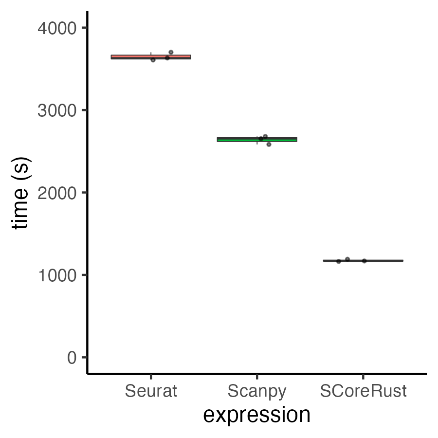
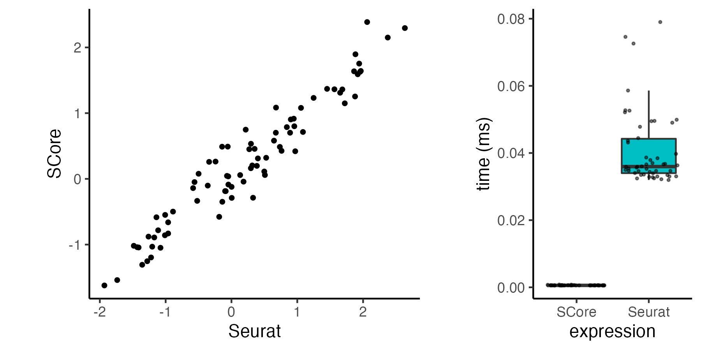

# SCoreRust, Single Cell Pathway Scoring powered by Rust

Speed can be workflow altering. By reimplementing pathway (KEGG/Reactome) scoring algorithms for single cell sequencing, higher analysis throughput, richer insights, and better interactivity can be achieved.

Wrappers to call the faster implementations directly in R are designed as in-place replacements for SingleCellExperiment and Seurat workflows.

Currently, a query of 10k cells x 3000 pathways takes:
* 60.6 min on `Seurat::AddModuleScore`
* 44.0 min through `scanpy.tl.score_genes`
* 19.5 min via R wrapper of rust functions `SCoreRust::calc_module_scores` (straight reimplementation)
* 1.76 min with `SCoreRust::calc_module_scores` further rewrite to by default reuse background calculations between each pathway



# Installation

```
# requires rustc (https://doc.rust-lang.org/book/ch01-01-installation.html)

# may also need to add `cargo` dir to PATH in R to build
# Sys.setenv(PATH = paste0(system("echo $HOME", intern = TRUE), "/.cargo/bin:",  Sys.getenv()["PATH"]))

remotes::install_github("https://github.com/raysinensis/SCoreRust/")
```

# Main functions

```
# single call for one pathway
?calc_modulescore

# multithreaded for processing large number of pathways
?calc_module_scores
```

# Small example

```
library(tidyverse)
library(Seurat)
so <- pbmc_small

# yielding similar scores, note that the random sampling isn't exactly the same
a <- ggplot(data.frame(Seurat = resa, SCore = resb), aes(x = Seurat, y = SCore)) + 
  geom_point(size = 1) +
  theme_classic() +
  coord_fixed()
  
# benchmark
res <- bench::mark(
  Seurat = AddModuleScore(so, features = list(c("LST1", "AIF1", "PSAP", "YWHAB", "MYO1G", "SAT1")), nbin = 10, ctrl = 10),
  SCore = calc_modulescore(as.matrix(so@assays$RNA@data),
                           c("LST1", "AIF1", "PSAP", "YWHAB", "MYO1G", "SAT1"),
                           rownames(as.matrix(so@assays$RNA@data))),
  iterations = 50,
  check = FALSE
)
b <- ggplot(res %>%
         mutate(expression = as.character(expression)) %>%
         select(expression, time) %>%
         unnest_longer(time), 
       aes(x = expression, y = time)) +
  geom_boxplot(aes(fill = expression), outlier.shape = NA) +
  geom_jitter(size = 0.5, alpha = 0.5) +
  theme_classic() +
  ylab("time (ms)") +
  NoLegend()
```



# Manuscript
[In situ spatial reconstruction of distinct normal and pathological cell populations within the human adrenal gland](https://doi.org/10.1210/jendso/bvad131)
